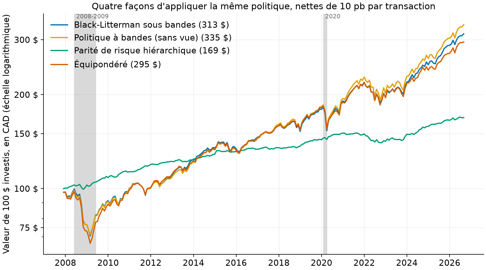
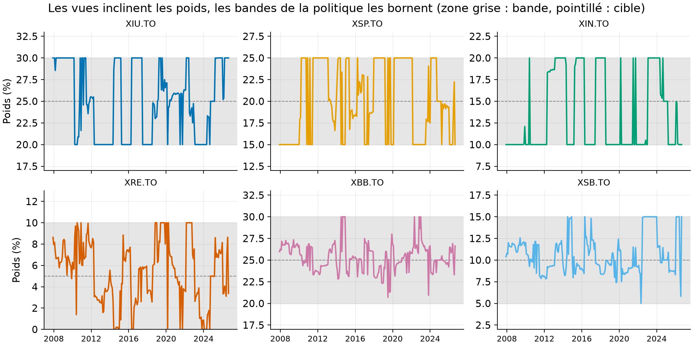
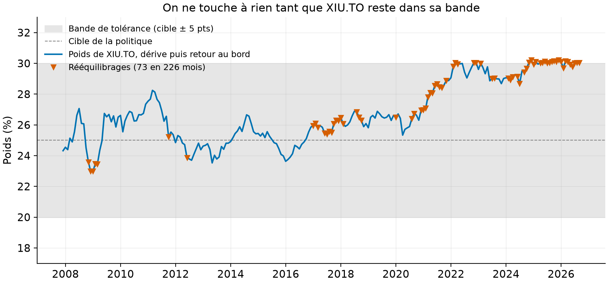
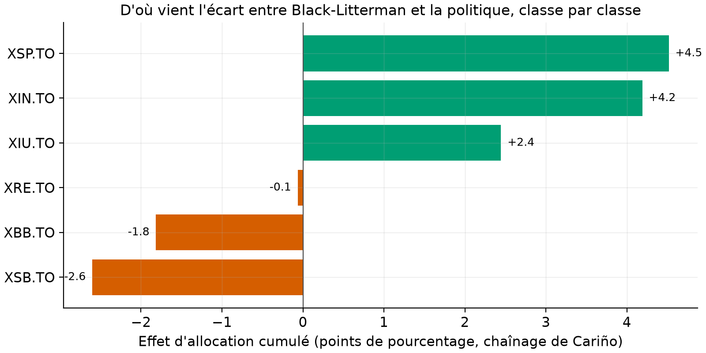

# Un moteur d'allocation sous politique de placement, vérifié contre les papiers puis appliqué au Canada

Ce dépôt fait le travail d'un gestionnaire de portefeuille institutionnel en deux moitiés. La première
construit et vérifie les quatre briques : Black-Litterman (validé chiffre à chiffre contre He-Litterman
1999 et Idzorek 2005), parité de risque hiérarchique (López de Prado 2016), attribution de
Brinson-Fachler avec chaînage de Cariño, et bandes de rééquilibrage avec coûts. La seconde les branche
sur six FNB de Toronto et fait tourner le tout pendant 18,75 ans, avec un rapport mensuel régénérable.

[](https://github.com/Guilou001/portfolio-ops-ca/actions/workflows/ci.yml)


**Résultat en une phrase.** Le module Black-Litterman reproduit l'exemple complet d'Idzorek (2005)
contre les tables imprimées du papier (**rendements a posteriori exacts aux deux décimales, poids à
0,02 point près**) ; appliqué à six FNB canadiens sur 226 mois hors échantillon (2007-2026), le moteur
à vues systématiques rapporte **6,28 % par an net de coûts, contre 6,66 %** pour la même politique
rééquilibrée par bandes sans aucune vue : la discipline des bandes bat les vues, et l'attribution de
Brinson montre où, classe par classe.

*English summary.* Institutional portfolio operations in two halves: first, tested building blocks
(Black-Litterman verified cell-by-cell against He-Litterman 1999 and Idzorek 2005; hierarchical risk
parity; Brinson-Fachler attribution with Cariño linking; investment-policy rebalancing bands with
costs); second, an end-to-end Canadian engine on six Toronto ETFs, 226 out-of-sample months
(2007-2026), with systematic momentum and long-term-reversal views sized by Idzorek confidences and
capped by the policy bands. Measured verdict: the view-driven portfolio earns 6.28 % a year net of
10 bp costs versus 6.66 % for the plain banded policy. A regenerable monthly report closes the loop.

## 1. La question posée

Comment un gestionnaire passe-t-il d'une politique de placement, le document qui fixe les cibles par
classe d'actifs et les bandes de tolérance autour, à des décisions mensuelles justifiables ? Il lui
faut quatre mécanismes : incliner l'allocation vers ses vues sans casser le portefeuille
(Black-Litterman), construire des poids robustes quand la covariance est bruitée (HRP), expliquer
chaque écart de rendement à la politique (attribution de Brinson), et rééquilibrer au bon moment sans
brûler la performance en coûts (bandes avec hystérésis). Ce dépôt implémente les quatre, les vérifie
contre les papiers, puis pose la question qui fâche : une fois branchées sur de vraies données
canadiennes, les vues rapportent-elles plus qu'elles ne coûtent ?

## 2. D'où vient le projet, et ce qu'il apporte

Black-Litterman est partout dans l'industrie et presque toujours implémenté de travers, parce que trois
conventions cohabitent sans être imprimées dans les papiers : le rôle de tau, la construction d'Omega,
et le fait que les poids non contraints ne somment pas à 1 (He-Litterman, note 5 : le portefeuille sans
vue détient exactement w_eq/(1+tau)). Ce que ce dépôt apporte :

- **La vérification contre les sources.** Les tables des deux papiers fondateurs ont été extraites en
  CSV (`refs/oracles/`, artefacts d'impression documentés) et servent de tests : chaque convention est
  tranchée par un chiffre imprimé, pas par une opinion de forum.
- **Les quatre modules dans un seul paquet cohérent**, avec les identités algébriques testées (les
  trois effets de Brinson somment exactement à l'écart actif ; les poids HRP sont positifs et somment
  à 1 ; une vue certaine est imposée exactement, une confiance nulle ne bouge rien).
- **La méthode d'Idzorek en fonction utilisable** : donner une confiance en pourcent à chaque vue, et
  le module calibre Omega numériquement pour que l'inclinaison des poids soit exactement cette fraction
  de l'inclinaison à confiance totale.
- **Un verdict hors échantillon.** La littérature vend Black-Litterman comme un cadre ; peu de dépôts
  publics mesurent ce que des vues mécaniques y gagnent réellement, nettes de coûts, contre la même
  politique sans vue. Ici le chiffre est mesuré, et il est négatif.

## 3. Première moitié : quatre modules, chacun garanti par autre chose qu'une opinion

Les données de cette moitié sont les chiffres imprimés des papiers eux-mêmes :

| Source | Contenu | Usage |
|---|---|---|
| He et Litterman (1999), PDF UPenn | 7 pays : volatilités, poids et rendements d'équilibre, corrélations ; delta = 2,5 | oracle d'équilibre ; convention Omega/tau (seul le rapport omega/tau compte) |
| Idzorek (2005), PDF Duke | 8 classes d'actifs : les 8 tables du papier ; lambda = 3,07, tau = 0,025 | oracle de la chaîne complète |

Deux honnêtetés d'extraction, documentées dans `refs/oracles/` : la version UPenn de He-Litterman
n'imprime des poids que pour un seul graphique (rien n'a été inventé pour les autres) ; trois cellules
d'Idzorek portent des artefacts d'arrondi du papier lui-même, conservés tels quels avec leur
explication.

1. **`black_litterman.py`.** L'optimisation inverse (les rendements qui justifient les poids de
   marché), la moyenne a posteriori entre équilibre et vues, la covariance d'estimation, les poids non
   contraints, l'Omega proportionnel de He-Litterman et l'Omega calibré par confiance d'Idzorek.
2. **`hrp.py`.** La parité de risque hiérarchique en trois étapes du papier de 2016 : arbre de
   corrélations, réordonnancement, bissection récursive à l'inverse de la variance. Aucune inversion
   de matrice.
3. **`brinson.py`.** L'attribution Brinson-Fachler (allocation, sélection, interaction) et le chaînage
   géométrique de Cariño : la somme des effets égale l'écart actif à 10⁻¹² près, testé.
4. **`policy.py`.** La politique de placement mécanisée : dérive des poids, bandes de tolérance avec
   hystérésis (on ne touche à rien tant qu'on est dans la bande), rééquilibrage au bord de bande,
   coûts en points de base.

Les résultats de vérification, tous mesurés par `uv run pops oracles` :

| Ce qui est comparé | Tolérance | Verdict |
|---|---:|---|
| Équilibre He-Litterman, 7 pays (delta = 2,5) | 0,05 pt | reproduit |
| Lambda d'Idzorek (prime de 3 % sur le marché) | 0,01 | 3,07, reproduit |
| Omega de l'équation 8 d'Idzorek | 5 × 10⁻⁷ | reproduit |
| Rendements a posteriori, 8 classes (Table 6) | 0,01 pt | exacts aux 2 décimales imprimées |
| Nouveaux poids (Table 6) | 0,02 pt | reproduits |
| Poids à confiance totale (Table 7) | 0,02 pt | reproduits |
| Confiances implicites (Table 7) | 0,2 pt | reproduites |

Comment lire ce tableau, en deux constats : d'abord, la chaîne Black-Litterman complète colle aux deux
papiers dans leurs conventions respectives, y compris la différence entre eux (Idzorek optimise avec
Sigma seule, He-Litterman avec Sigma plus la covariance d'estimation, les deux sont dans le module et
testées) ; ensuite, les tolérances non nulles viennent des arrondis d'impression des papiers,
documentés cellule par cellule dans `refs/oracles/idzorek_parametres.md`, pas de l'implémentation.

## 4. Seconde moitié : le moteur canadien, de la politique au rapport mensuel

### Les données : six FNB de Toronto, une politique équilibrée

Un FNB, un fonds négocié en Bourse qui réplique un indice et s'achète comme une action, donne à un
investisseur canadien chaque grande classe d'actifs en un seul titre. Les six retenus sont les plus
anciens de leur classe, et la politique du dépôt est un profil équilibré classique, 65 % croissance et
35 % revenu :

| FNB | Classe d'actifs | Cible | Bande |
|---|---|---:|---:|
| XIU.TO | Actions canadiennes (S&P/TSX 60) | 25 % | ± 5 pts |
| XSP.TO | Actions américaines (S&P 500, couvert en CAD) | 20 % | ± 5 pts |
| XIN.TO | Actions internationales (MSCI EAFE, couvert en CAD) | 15 % | ± 5 pts |
| XRE.TO | Immobilier coté (FPI canadiennes) | 5 % | ± 5 pts |
| XBB.TO | Obligations canadiennes (univers) | 25 % | ± 5 pts |
| XSB.TO | Obligations court terme | 10 % | ± 5 pts |

« Couvert en CAD » signifie que le fonds neutralise le taux de change : le rendement vient des actions,
pas du dollar. Les prix, ajustés des dividendes (le rendement mesuré est donc un rendement total),
viennent de Yahoo Finance par `pops fetch` et ne sont jamais commités (licence d'usage personnel). Le
plus jeune des six FNB naît en octobre 2002 ; avec 60 mois d'historique de chauffe, la première
décision du moteur tombe en novembre 2007, mesuré.

### La méthode, pas à pas

Le backtest est un walk-forward, la règle qui interdit de voir le futur : la décision du mois t
n'utilise que les mois antérieurs à t. Chaque mois :

1. la covariance des rendements s'estime sur les 60 mois précédents, annualisée ;
2. l'équilibre est celui de la politique : Pi = delta Sigma w_cible, les rendements qui justifieraient
   de détenir exactement les cibles (delta = 2,5, la valeur de He-Litterman) ;
3. deux vues systématiques se calculent sur le même historique (définies ci-dessous), et la méthode
   d'Idzorek convertit leurs confiances en Omega ;
4. les rendements a posteriori donnent des poids optimaux sous deux contraintes, investi à 100 % et
   chaque poids dans sa bande : les vues ne peuvent jamais faire sortir le portefeuille du document de
   politique, par construction ;
5. chaque dollar échangé coûte 10 points de base (0,10 %), l'ordre de grandeur d'un écart
   achat-vente sur ces FNB liquides ; l'achat initial paie aussi ses 10 pb.

Les deux vues sont mécaniques, aucune opinion humaine :

- **Momentum 12-1** (Jegadeesh et Titman, 1993) : parmi les trois poches d'actions, celle qui a le
  mieux performé sur les douze mois passés, dernier mois exclu, battra la pire de 2 % par an,
  confiance 50 %.
- **Renversement de long terme** (De Bondt et Thaler, 1985), le proxy de valorisation fondé sur les
  prix : la poche la plus faible sur cinq ans battra la plus forte de 1 % par an, confiance 25 %.

Les écarts attendus (2 %, 1 %) et les confiances (50 %, 25 %) sont des choix déclarés, pas des
estimations : ils dosent l'ampleur des inclinaisons, que les bandes plafonnent de toute façon à
5 points.

Trois références subissent exactement le même traitement sur la même période : la politique
rééquilibrée par bandes sans aucune vue, la parité de risque hiérarchique réestimée chaque mois, et
l'équipondéré (un sixième dans chaque FNB).

## 5. Les résultats : la discipline bat les vues (mesuré)

Tous les chiffres viennent de `results/tables/backtest_resume.csv` et `rendements_nets.csv`,
régénérés par `uv run pops backtest` ; période 2007-11 à 2026-08, 226 mois, nets de 10 pb par
transaction.

| Portefeuille | Rendement annualisé | Volatilité | Rendement/volatilité | Pire creux | 100 $ deviennent |
|---|---:|---:|---:|---:|---:|
| Politique à bandes (sans vue) | **6,66 %** | 9,25 % | 0,72 | −27,8 % | 335 $ |
| Black-Litterman sous bandes | 6,28 % | 9,03 % | 0,70 | −29,2 % | 313 $ |
| Équipondéré | 5,94 % | 9,23 % | 0,64 | −31,5 % | 295 $ |
| Parité de risque hiérarchique | 2,83 % | 2,49 % | 1,14 | −7,0 % | 169 $ |

Comment lire ce tableau, en trois constats. D'abord, la politique à bandes sans aucune vue gagne :
les vues coûtent 36 points de base par an en net (calculé sur les deux séries de rendements), alors
même qu'elles ajoutent bien de l'allocation brute (+11 pb par an contre la politique ramenée aux
cibles chaque mois, mesuré par l'attribution ci-dessous) ; la différence part en rotation, 84 % du
portefeuille échangé par an, soit environ 8 pb de coûts, et dans le renoncement à laisser courir les
gagnants dans leur bande. Ensuite, l'équipondéré, pourtant si difficile à battre dans la littérature
(DeMiguel, Garlappi et Uppal, 2009), perd ici contre la politique : ses 16,7 % dans l'immobilier coté
et ses 33 % d'obligations ne sont pas une meilleure allocation que le 65/35. Enfin, la parité de
risque hiérarchique ne joue pas dans la même catégorie de risque : ses poids à l'inverse de la
variance la concentrent dans les obligations court terme, d'où une volatilité de 2,5 %, un creux de
7 % et le meilleur rendement par unité de risque du tableau ; c'est un autre produit, pas une
meilleure version du même.



Comment lire cette figure : chaque courbe est la valeur de 100 $ investis en novembre 2007, nette de
coûts, en échelle logarithmique (une pente constante y signifie un rendement constant) ; les zones
grises marquent 2008-2009 et 2020. Les trois portefeuilles équilibrés se suivent de près et perdent
entre un quart et un tiers de leur valeur en 2008-2009 ; la courbe verte, la parité de risque,
traverse 2008 presque à plat puis paie ce confort par dix-huit ans de rendement obligataire.



Comment lire cette figure : un panneau par FNB, le poids décidé chaque mois (trait de couleur), la
cible (pointillé) et la bande (zone grise) ; l'axe vertical de chaque panneau est centré sur sa bande.
Le trait touche souvent un bord de bande et en change par à-coups : l'optimiseur pousse chaque vue
jusqu'à sa borne, et c'est la bande, pas la vue, qui fixe la taille du pari. C'est le comportement
attendu d'une moyenne-variance sous contraintes de boîte, et la source de la rotation de 84 % par an.



Comment lire cette figure : le poids de XIU.TO dans la politique SANS vue dérive au gré des marchés
(trait bleu) ; tant qu'il reste dans la zone grise, on ne touche à rien ; quand une classe sort de sa
bande, tout le portefeuille est ramené au bord de bande (triangles), pas à la cible, parce que c'est
moins coûteux. 73 rééquilibrages en 226 mois, environ un mois sur trois ; les triangles se
concentrent après 2016, quand la hausse des actions pousse XIU contre son plafond de 30 %.



Comment lire cette figure : chaque barre est l'effet d'allocation cumulé d'une classe sur 18,75 ans,
en points de richesse, au chaînage de Cariño ; les deux portefeuilles détenant les mêmes FNB, l'effet
de sélection est nul par construction et tout l'écart est de l'allocation. Les vues ont gagné sur les
trois poches d'actions (+4,5 points sur XSP, +4,2 sur XIN, +2,4 sur XIU) et perdu sur les obligations
(−2,6 sur XSB, −1,8 sur XBB) : incliner entre actions a payé en brut, financer ces paris en
sous-pondérant les obligations a repris une partie du gain, et les coûts ont fait le reste.

## 6. Le rapport mensuel, régénérable en une commande

`uv run pops report` rejoue la décision du dernier mois observé et écrit
`reports/monthly/AAAA-MM.md` : positions recommandées contre leurs bandes, vues du mois avec leur
confiance, figure de l'inclinaison des rendements attendus (équilibre contre a posteriori), chaque
tableau suivi de sa phrase de lecture. Le dépôt commite [l'exemple d'août 2026](reports/monthly/2026-08.md) ;
relancer la commande un mois plus tard produit le suivant, sans intervention.

## 7. Reproduire

```bash
uv sync --locked --all-extras     # environnement verrouillé (Python 3.12, pandas 3)
uv run pytest                     # 27 tests : 8 oracles papier + 11 propriétés + 8 moteur (3 s, sans réseau)
uv run pops fetch                 # prix Yahoo des six FNB (quelques secondes, non commités)
uv run pops backtest              # 226 mois, tables + 4 figures (2,6 s mesurées)
uv run pops report                # le rapport du dernier mois
```

Les tests tournent sans réseau (les oracles sont des CSV commités, le moteur est testé sur données
synthétiques) ; la CI les rejoue à chaque commit. Les tables et figures de résultats sont commitées,
les prix bruts jamais.

## 8. Limites, avec leur statut

| Limite | Statut |
|---|---|
| Le backtest commence en novembre 2007 (naissance du plus jeune FNB en 2002 plus 60 mois de chauffe), pas en 1996 comme prévu initialement | mesuré ; aucun FNB canadien ne couvre 1996, et le dépôt n'utilise que des données libres |
| Les Q (2 %, 1 %) et confiances (50 %, 25 %) des vues sont des choix déclarés, non optimisés ; les optimiser sur la période testée serait du surajustement | reconnu et assumé |
| Le rendement/volatilité du tableau n'est pas un ratio de Sharpe : le taux sans risque n'est pas soustrait | déclaré dans le code et ici |
| Coûts fixés à 10 pb par dollar échangé, sans impact de marché ni taxes ; les frais de gestion des FNB sont dans les prix | hypothèse déclarée |
| Un seul profil de politique testé (équilibré 65/35) ; les conclusions ne se transfèrent pas d'office à un profil prudent ou croissance | reconnu |
| Entropy pooling (vues non linéaires) et vues sur données fondamentales (valorisation comptable) | non fait ; le renversement 5 ans sert de proxy de valorisation par les prix |
| La version UPenn de He-Litterman n'imprime pas les tables 4 à 7 des autres éditions | non trouvé ; l'oracle se limite à ce que ce PDF imprime |

## 9. Crédits, licence, citation

He, G. et Litterman, R. (1999), « The Intuition Behind Black-Litterman Model Portfolios », Goldman
Sachs Investment Management Research ; Idzorek, T. (2005), « A Step-by-Step Guide to the
Black-Litterman Model » ; López de Prado, M. (2016), « Building Diversified Portfolios that
Outperform Out of Sample », Journal of Portfolio Management ; Brinson, G. et Fachler, N. (1985) ;
Cariño, D. (1999) ; Jegadeesh, N. et Titman, S. (1993) ; De Bondt, W. et Thaler, R. (1985) ;
DeMiguel, V., Garlappi, L. et Uppal, R. (2009). Données : Yahoo Finance, usage personnel, non
redistribuées. Code : Guillaume Vaudescal, 2026, licence MIT ; les valeurs des oracles restent celles
des papiers cités.
