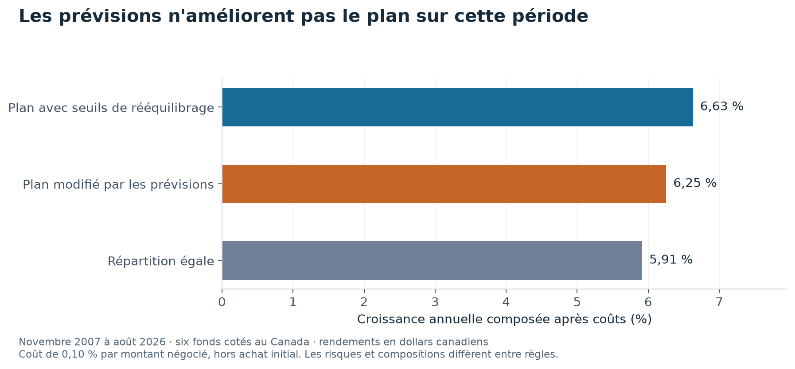

# Gérer un portefeuille en suivant des règles fixées à l'avance

Un plan de placement précise quelle part de l'argent va aux actions, aux obligations et à l'immobilier. Mais les prix changent. Une part prévue à 25 % peut devenir trop grande après une hausse.

Le gestionnaire doit décider quand revenir vers son plan. Il peut aussi modifier les montants parce qu'il prévoit qu'un marché fera mieux qu'un autre. Ce projet compare ces deux décisions sur six fonds cotés à Toronto.

**Le plan suivi sans prévisions rapporte davantage sur la période étudiée.** Les prévisions ajoutées n'améliorent pas le résultat après les frais.

## Attendre une limite avant d'acheter ou de vendre

Une bande de tolérance est l'écart autorisé autour de la part prévue. Pour les actions canadiennes, la cible est 25 % et la zone autorisée va de 20 % à 30 %.



Les barres comparent la croissance annuelle après coûts. La règle qui attend le franchissement des limites finit devant celle qui ajoute des prévisions. Le tableau suivant donne aussi leur plus forte baisse.

## Ce que donnent les deux choix

| Règle | Rendement annuel composé | Plus forte baisse depuis un sommet |
|---|---:|---:|
| Suivre les bandes sans prévisions | 6,63 % | −28,1 % |
| Modifier les parts avec des prévisions | 6,25 % | −29,2 % |
| Mettre la même somme dans chaque fonds | 5,91 % | −31,5 % |

Ces résultats couvrent **novembre 2007 à août 2026**, soit 226 mois. Les frais sont de 0,10 % par montant échangé. L'achat initial n'est facturé à aucune des règles. [Table complète](results/tables/backtest_resume.csv).

## Comment les décisions sont prises

Les prévisions reposent sur les hausses récentes et sur les baisses des cinq dernières années. Le modèle de Black-Litterman les combine avec le plan initial, en tenant compte de la confiance accordée à chacune.

Le programme utilise seulement les mois antérieurs à la décision. Les montants restent dans les bandes autorisées. Il produit ensuite un [rapport mensuel](reports/monthly/2026-08.md) qui indique les positions et explique leurs écarts au plan.

## Les limites du résultat

Le test porte sur un seul profil, avec 65 % d'actifs de croissance et 35 % d'obligations. Les prévisions et leur degré de confiance sont des choix déclarés. Le résultat ne condamne donc pas toutes les prévisions possibles. La fiscalité et l'effet des gros ordres sur les prix ne sont pas modélisés.

## Refaire les calculs

```bash
uv sync --locked --all-extras
uv run pops fetch
uv run pops backtest
uv run pops report
uv run pytest
```

Les commandes de téléchargement accèdent aux sources externes. Les résultats publiés restent consultables sans lancer les calculs. Le graphique de présentation se régénère hors réseau avec `uv run python scripts/figure_presentation.py`, depuis les tableaux publiés.

## Pour aller plus loin

[Méthodes, résultats complets et références](docs/ETUDE_DETAILLEE.md) · [Présentation en PDF](rapport/rapport.pdf) · [Citer le projet](CITATION.cff) · [Licence](LICENSE).

## English summary

A Canadian portfolio following fixed allocation bands outperforms the tested forecast-driven allocation after costs over November 2007 to August 2026. The result concerns one policy and two specified forecast rules.
