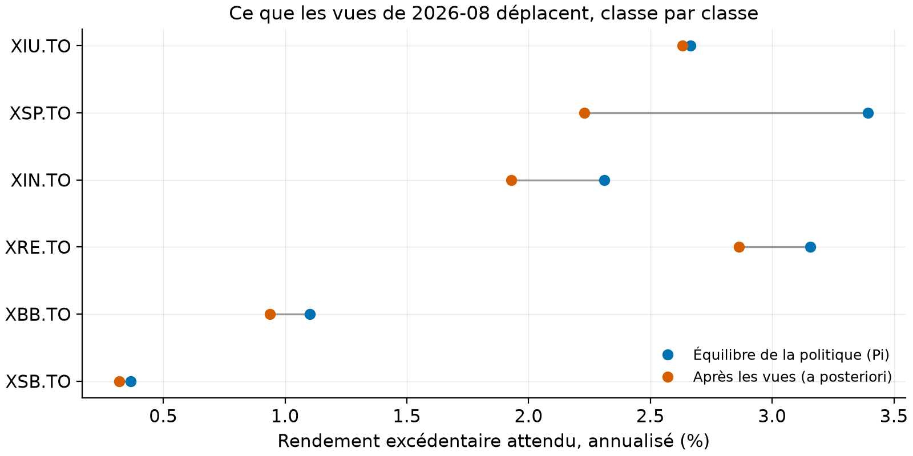

# Rapport de placement, 2026-08

Généré par `pops report` sur les prix arrêtés à fin 2026-08 ; fenêtre d'estimation de 60 mois (2021-09 à 2026-08), delta = 2.5, tau = 0.025. Chaque chiffre de ce rapport est recalculé à la génération.

## Les positions recommandées, contre la politique

| Classe | Cible | Bande | Poids recommandé | Écart à la cible |
|---|---:|---:|---:|---:|
| XIU.TO | 25 % | ± 5 pts | 30.0 % | +5.0 pts |
| XSP.TO | 20 % | ± 5 pts | 15.0 % | -5.0 pts |
| XIN.TO | 15 % | ± 5 pts | 10.0 % | -5.0 pts |
| XRE.TO | 5 % | ± 5 pts | 3.5 % | -1.5 pts |
| XBB.TO | 25 % | ± 5 pts | 26.5 % | +1.5 pts |
| XSB.TO | 10 % | ± 5 pts | 15.0 % | +5.0 pts |

Comment lire ce tableau : le poids recommandé vient de l'optimisation sous bandes, il ne peut pas sortir de « cible ± bande », donc l'écart à la cible mesure la force de la vue, plafonnée à 5 points par construction.

## Les vues du mois

| Vue | Favorise | Défavorise | Écart attendu (an) | Confiance |
|---|---|---|---:|---:|
| momentum | XIU.TO | XSP.TO | +2 % | 50 % |
| renversement | XSP.TO | XIU.TO | +1 % | 25 % |

Comment lire cette figure : chaque ligne est une classe d'actifs ; le point bleu est le rendement excédentaire annualisé qui justifierait les cibles de la politique (l'équilibre Pi), le point vermillon le rendement une fois les vues du mois mélangées à cet équilibre. L'écart entre les deux points est l'effet combiné des vues, dosé par leurs confiances via l'Omega d'Idzorek.
